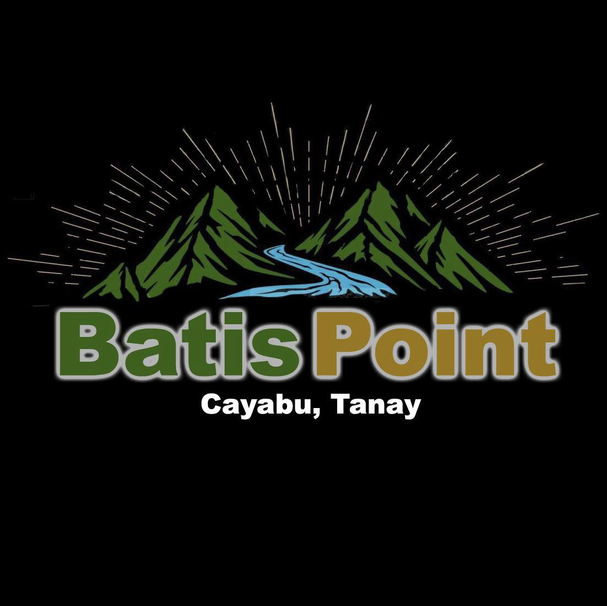

<a name="readme-top"></a>

<br/>
<br/>

<div align="center">
  <a href="https://github.com/Kirkiee">
    
  </a>
<!-- * Title Section -->
  <h3 align="center">AD - CI4 Template</h3>
</div>

<!-- * Description Section -->
<div align="center">
This repository contains the source for my "Batis Point" website. It implements a functional camping site built with CodeIgniter 4 with the following core functionalities: Admin Dashboard with management and employee assignment, simple calendar system to view available booking dates, gallery, inquiry, service scheduling, and inclusions. 
</div>

<br/>


<!-- ! Make sure it was similar to your github -->

---

<br/>
<br/>

<details>
  <summary>Table of Contents</summary>
  <ol>
    <li>
      <a href="#overview">Overview</a>
      <ol>
        <li>
          <a href="#key-components">Key Components</a>
        </li>
        <li>
          <a href="#technology">Technology</a>
        </li>
      </ol>
    </li>
    <li>
      <a href="#rules-practices-and-principles">Rules, Practices and Principles</a>
    </li>
    <li>
      <a href="#resources">Resources</a>
    </li>
  </ol>
</details>

---

## Overview

This repository is a working demo website showcasing the implementation of a small resort management system using CodeIgniter 4.
It is intentionally opinionated and serves as a demonstration of structure, workflow, and feature conventions for small-scale business web applications.

The demo focuses on Batis Point, a local camping site and leisure destination — featuring examples of how to manage and display services, handle inquiries, and organize administrative workflows.

It is designed to be **easy to start with** and a **reference for adding new features**.

To demonstrate a practical, real-world web system that applies common CodeIgniter 4 patterns — from controllers to services to data models — with clean, maintainable code and modular design.

### Key Components

## 🧱 Key Components

These are **sample modules** included (or suggested) for learning how to add features in the **Batis Point** resort management system:

| Component | Purpose | Notes |
| ---------- | -------- | ----- |
| **Auth (Sample)** | Basic login/logout and role-based access (admin/staff). | Implements CI4 sessions and authentication logic for secure admin areas. |
| **Service Listing** | Public view displaying resort amenities, rates, and inclusions. | Demonstrates dynamic data rendering and content management through CRUD. |
| **Inquiry & Booking System** | Handles guest inquiries and service booking requests. | Includes form validation, submission tracking, and database integration. |
| **Service CRUD Module** | Admin can add, update, or remove services offered at Batis Point. | Example of Controller → Service → Repository data flow pattern. |
| **Request Management** | Admins and staff can review, assign, and update client requests. | Showcases relational handling between client requests and employee assignments. |
| **Employee Assignment** | Assigns specific employees to service or booking requests. | Demonstrates user-role interaction and data linking in CI4. |
| **Admin Dashboard** | Provides overview cards for system health, services, and active inquiries. | Uses Tailwind UI cards and status indicators following Batis Point color theme. |
| **Calendar Overview (Sample)** | Displays upcoming bookings or service schedules in calendar format. | Example of integrating lightweight date visualization tools. |
| **Gallery Page** | Showcases resort facilities, rooms, and amenities. | Uses responsive image layouts and optional upload functionality for admins. |
| **Waze Integration** | Provides quick navigation access to the resort’s physical location. | Demonstrates embedding third-party tools on landing pages. |


 <!-- ! Start simple. Use these modules as **learning samples**; extend or replace them based on your project’s needs. -->

### Technology

#### Language


#### Framework/Library


<!-- ! Keep only the used technology -->

---

## Quick Start (Docker)

Run the development stack and the app (rebuild if needed):

```cmd
docker compose up --watch
```

- Create a controller (add --resource to scaffold resourceful methods if you like) (using CodeIgniter's spark tool):
```cmd
docker compose exec php php spark make:controller Usars
```

## Ports & Database

Defaults used in this project (host mapping):

| Service     | Host port |
|-------------|-----------:|
| nginx (app) | 8090      |
| phpMyAdmin  | 8091      |
| MySQL       | 3390      |

Database credentials used in examples and CI:

- Host: localhost
- Port: 3390
- Database: app
- User: root
- Password: root

Be careful: seeding and truncating are destructive operations — run only on local/dev environments unless you know what you're doing.

## Rules, Practices and Principles

<!-- ! Dont Revise this -->

1. Always prefix project titles with `AD-`.
2. Place files in their **respective CI4 folders** (`Controllers/`, `Services/`, `Repositories/`, `Views/`).
3. Naming conventions:

   | Type             | Case        | Example                   |
   | ---------------- | ----------- | ------------------------- |
   | Classes          | PascalCase  | `UserService.php`         |
   | Interfaces       | PascalCase  | `UserRepositoryInterface` |
   | DB tables/fields | snake\_case | `users`, `created_at`     |
   | Docs             | kebab-case  | `dev-manual.md`           |

4. Git commits use: `feat`, `fix`, `docs`, `refactor`.
5. Use **Controller → Service → Repository** pattern.
6. Assets (CSS/JS/img) live under `public/`.
7. Docker configs are at the repo root (`docker-compose.yml`, `nginx.conf`).
8. Docs are maintained in `/docs` (dev, technical, sop, commit, principles, copilot).

Example structure:

```
AD-ProjectName/
├─ backend/ci4/
│  ├─ app/Controllers/
│  ├─ app/Services/
│  ├─ app/Repositories/
│  ├─ app/Views/
│  ├─ public/
│  ├─ writable/
│  ├─ .env
│  └─ composer.json
├─ docker/               # Docker configs at root
├─ docs/                 # Manuals and project docs
├─ .gitignore
└─ readme.md
```

<!-- ! Dont Revise this -->

---

## Resources

| Title                   | Purpose                                                               | Link                                                                       |
| ----------------------- | --------------------------------------------------------------------- | -------------------------------------------------------------------------- |
| ChatGPT                 | General AI assistance for planning application architecture and docs. | [https://chat.openai.com](https://chat.openai.com)                         |
| GitHub Copilot          | In-IDE code suggestions and boilerplate generation.                   | [https://github.com/features/copilot](https://github.com/features/copilot) |


<!-- ! Add what tools aided you -->
